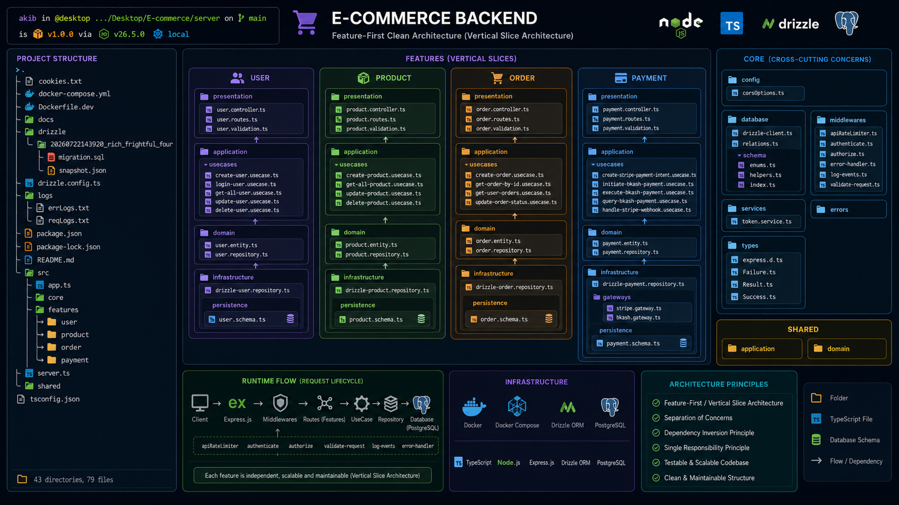

# E-Commerce Backend Documentation

Welcome to the documentation for the **E-Commerce Backend**, built with **Node.js**, **Express.js**, **TypeScript**, **PostgreSQL**, **Drizzle ORM**, and **Docker** using a **Feature-First Clean Architecture (Vertical Slice Architecture)**.

---

# Architecture Overview



This project follows a **Feature-First Clean Architecture**, where each feature (User, Product, Order, Payment) is self-contained and organized into its own domain, application, infrastructure, and presentation layers.

For a detailed explanation, see:

- [Backend Structure](./docs/02-Architecture/Backend-Structure.md)
- [Entity-Relationship Diagram (ERD)](<./docs/02-Architecture/Entity-Relationship-Diagram-(ERD).md%3E>)

---

# Getting Started

Follow the guides below in order to set up and run the project locally.

## 1. Project Setup

Create the project, install dependencies, and configure TypeScript.

→ [Project Initialization](./docs/01-Getting-Started/Project-Initialization.md)

---

## 2. Configure Environment Variables

Create the `.env` file and configure the application settings.

→ [Environment Variable Setup](./docs/01-Getting-Started/Environment-Variable-Setup.md)

---

## 3. Docker Setup

Run the backend and PostgreSQL using Docker Compose.

→ [Get Started with Docker](./docs/01-Getting-Started/Get-Started-with-Docker.md)

---

## 4. Configure Drizzle ORM

Connect Drizzle to PostgreSQL, define schemas, and manage database migrations.

→ [Get Started with Drizzle and PostgreSQL](./docs/01-Getting-Started/Get-Started-with-Drizzle-and-PostgreSQL.md)

---

# Running the Application

Once the project has been configured, start the application with:

```bash
docker compose up --build -d
```

The backend server will be available at:

```text
http://localhost:<PORT>
```

where `<PORT>` is the value configured in your `.env` file.

---

# Payment Integration

This project supports both **Stripe** and **bKash** payment gateways.

Before integrating either gateway, obtain the required API credentials by following:

→ [Setup & Prerequisites Guide Stripe & bKash](./docs/03-Payment/Setup-&-Prerequisites-Guide-Stripe-&-bKash.md)

After completing the prerequisites, configure the payment implementation:

→ [Payment Gateway (Bkash, Stripe)](<./docs/03-Payment/Payment-Gateway-(Bkash,Stripe).md>)

---

# API Testing

After the server is running, verify the API using tools such as:

- curl
- Postman
- Insomnia

For complete request examples and endpoint documentation, see:

→ [API Documentation & curl Testing Guide](./docs/04-Testing/API-Documentation-&-curl-Testing-Guide.md)

---

# Recommended Reading Order

If this is your first time working with the project, read the documentation in the following order:

1. [Project Initialization](./docs/01-Getting-Started/Project-Initialization.md)
2. [Environment Variable Setup](./docs/01-Getting-Started/Environment-Variable-Setup.md)
3. [Get Started with Docker](./docs/01-Getting-Started/Get-Started-with-Docker.md)
4. [Get Started with Drizzle and PostgreSQL](./docs/01-Getting-Started/Get-Started-with-Drizzle-and-PostgreSQL.md)
5. [Backend Structure](./docs/02-Architecture/Backend-Structure.md)
6. [Entity-Relationship Diagram (ERD)](<./docs/02-Architecture/Entity-Relationship-Diagram-(ERD).md>)
7. [Setup & Prerequisites Guide Stripe & bKash](./docs/03-Payment/Setup-&-Prerequisites-Guide-Stripe-&-bKash.md)
8. [Payment Gateway (Bkash, Stripe)](<./docs/03-Payment/Payment-Gateway-(Bkash,Stripe).md>)
9. [API Documentation & curl Testing Guide](./docs/04-Testing/API-Documentation-&-curl-Testing-Guide.md)
