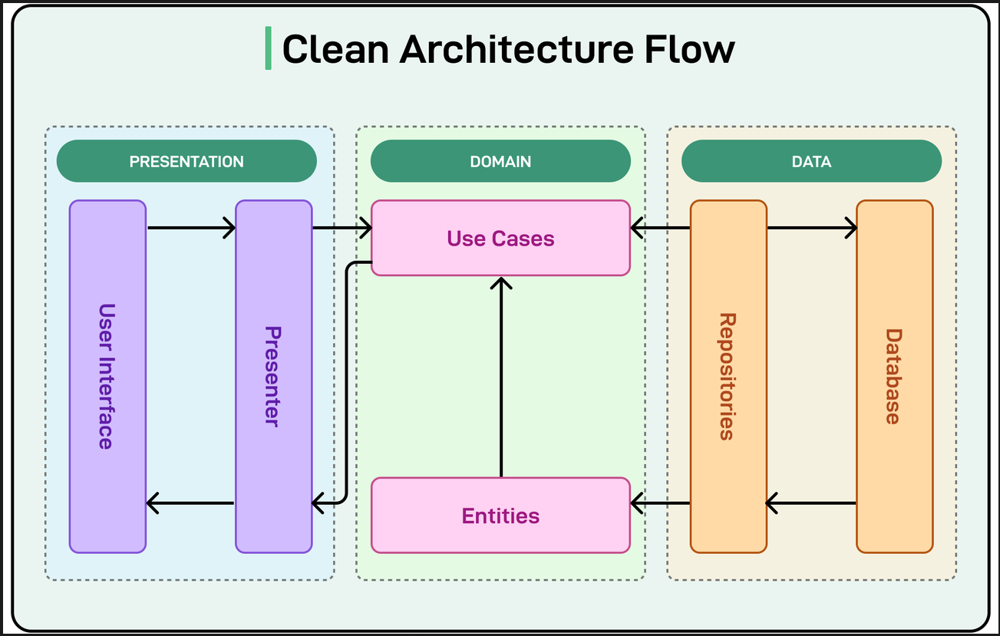

## Feature-First Clean Architecture (Vertical Slice Architecture)

## 1. What Is It?

**Feature-First Clean Architecture** (or **Vertical Slice**) organizes code by **business feature** (`login`, `paymet`) rather than technical layers (`controllers`, `repositories`).

Each feature folder contains its own self-contained Clean Architecture layers:

```text
src/features/user/
├── domain/          # Business entities & interfaces (Ticket.ts, ITicketRepository.ts)
├── application/     # Workflows & Use Cases (CreateTicketUseCase.ts)
├── infrastructure/  # DB & Third-party integrations (PostgresTicketRepository.ts)
└── presentation/    # Express routes & controllers (TicketRoutes.ts)

```

---

## 2. How Feature-First Enforces SOLID

- **S — Single Responsibility:** Each feature slice owns _one_ business domain.
- **O — Open/Closed:** Add new features by creating new folders—without modifying existing feature code.
- **L — Liskov Substitution:** Swap implementations (e.g., Postgres $\rightarrow$ In-Memory) behind domain interfaces.
- **I — Interface Segregation:** Interfaces are small and feature-focused (`ITicketRepository`), not monolithic.
- **D — Dependency Inversion:** Use cases depend on abstract domain interfaces, never on Express or Postgres.

---

## 3. Architecture Comparison

| Architecture            | Code Grouping                                     | Cohesion | Best Used For                               |
| ----------------------- | ------------------------------------------------- | -------- | ------------------------------------------- |
| **MVC**                 | By framework role (`Controllers`, `Models`)       | Low      | Quick prototypes & small CRUD apps          |
| **Layer-First Clean**   | By technical layer (`/domain`, `/infrastructure`) | Medium   | Apps with heavy domain logic                |
| **Feature-First Clean** | By feature slice (`/features/tickets`)            | **High** | Scalable production apps & team projects    |
| **Microservices**       | By independent server repos                       | **High** | Massive orgs requiring separate deployments |

### Core Distinctions

- **vs. MVC:** MVC tightly couples business logic to database models. Feature-First decouples business logic entirely from Express and SQL.
- **vs. Layer-First:** Layer-First forces you to open 4+ distant folders to edit one feature ("shotgun surgery"). Feature-First keeps all related code in **one folder**.
- **vs. Microservices:** Feature-First gives you the modularity of microservices inside a single, easy-to-deploy **Modular Monolith**.

---

## 4. Key Benefits

1. **High Cohesion:** Modifying or deleting a feature starts and ends inside a single directory.
2. **Fewer Merge Conflicts:** Developers work inside separate feature folders without clashing on Git branches.
3. **Microservice Ready:** If a feature outgrows the monolith, you can extract its folder into a standalone service with minimal refactoring.
4. **Stack Alignment:** Keeps your backend directory structure matching your frontend (e.g., Flutter Feature-First).



Fig: Clean Architecture

### 1. Directory Structure

```bash
src/
├── core/                           # Shared / System-wide concerns
│   ├── database/                   # Postgres pool connection
│   │   └── postgres-client.ts
│   ├── errors/                     # AppError, DomainError classes
│   │   └── AppError.ts
│   ├── middlewares/                # Global Express middlewares
│   │   ├── errorHandler.ts
│   │   └── authMiddleware.ts
│   └── types/                      # Common TypeScript types/interfaces
│
├── features/                       # Self-contained feature modules
│   │
│   ├── repair-tickets/             # [Feature 1] Repair Tickets
│   │   ├── domain/                 # Ticket Entity, Ticket Status VOs, ITicketRepository
│   │   │   ├── Ticket.ts
│   │   │   └── ITicketRepository.ts
│   │   ├── application/            # CreateTicketUseCase, UpdateStatusUseCase
│   │   │   ├── CreateTicketUseCase.ts
│   │   │   └── dtos/
│   │   ├── infrastructure/         # PostgresTicketRepository (DB driver code)
│   │   │   └── PostgresTicketRepository.ts
│   │   └── presentation/           # Express Controller, Routes, Zod Schemas
│   │       ├── TicketController.ts
│   │       ├── TicketRoutes.ts
│   │       └── TicketSchemas.ts
│   │
│   ├── customers/                  # [Feature 2] Customer Management
│   │   ├── domain/
│   │   ├── application/
│   │   ├── infrastructure/
│   │   └── presentation/
│   │
│   ├── inventory/                  # [Feature 3] Spare Parts & Stock
│   │   ├── domain/
│   │   ├── application/
│   │   ├── infrastructure/
│   │   └── presentation/
│   │
│   └── billing/                    # [Feature 4] Invoices & Payments
│       ├── domain/
│       ├── application/
│       ├── infrastructure/
│       └── presentation/
│
├── app.ts                          # Express application initialization
└── server.ts                       # HTTP server start & DB listener
```
