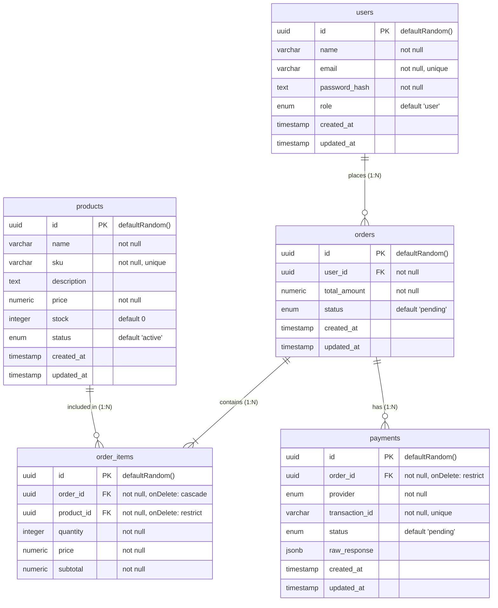

### What is an ERD?

An **Entity-Relationship Diagram (ERD)** is a visual representation of a database's structure. It maps out the key entities (tables), their attributes (columns/fields), and the explicit relationships (one-to-many, many-to-many) between them. It serves as a blueprint for understanding how data flows, how tables depend on one another, and how database integrity rules (like cascade vs. restrict deletions) are enforced.

---

### Description of This Database

This schema models a standard **E-Commerce Core System** built with **Drizzle ORM** and **PostgreSQL**. It handles user accounts, product management, cart order processing, and multi-gateway payment tracking:

* **Users (`usersTable`):** Stores customer credentials and roles (`user` vs. `admin`). Acts as the root entity for order history.
* **Products (`productsTable`):** Holds product catalog details, including pricing, stock levels, SKUs, and active/inactive availability statuses.
* **Orders & Order Items (`ordersTable`, `orderItemsTable`):** Represents customer purchases in a parent-child relationship:
* `orders` captures high-level status (e.g., `pending`, `paid`) and total monetary amount.
* `order_items` freezes product pricing at the moment of checkout and tracks item quantities. Cascade deletion guarantees that purging an order automatically cleans up its associated item line entries.

* **Payments (`paymentsTable`):** Tracks payment attempts across different providers (e.g., Stripe, bKash). It logs unique transaction IDs, status states, and stores raw JSON responses from payment webhooks for audit and reconciliation purposes. Deletions on orders with payment histories are restricted to maintain financial records integrity.

### Diagram of Database

### Relationship Breakdown

* **Users to Orders (1:N):** A single user can place zero or many orders (`users.orders: r.many.orders()`), but each order belongs to exactly one user (`orders.userId` references `users.id`).
* **Orders to Order Items (1:N):** A single order contains one or many order items (`orders.items: r.many.orderItems()`). If an order is deleted, its items are destroyed (`onDelete: "cascade"`).
* **Products to Order Items (1:N):** A product can appear in zero or many order items across different orders (`products.orderItems: r.many.orderItems()`). The database restricts the deletion of a product if it is referenced in an existing order item (`onDelete: "restrict"`).
* **Orders to Payments (1:N):** A single order can have zero or many payment attempts/records (`orders.payments: r.many.payments()`), while each payment record belongs directly to a single order (`payments.orderId` references `orders.id`). Deleting an order with existing payment records is restricted (`onDelete: "restrict"`).